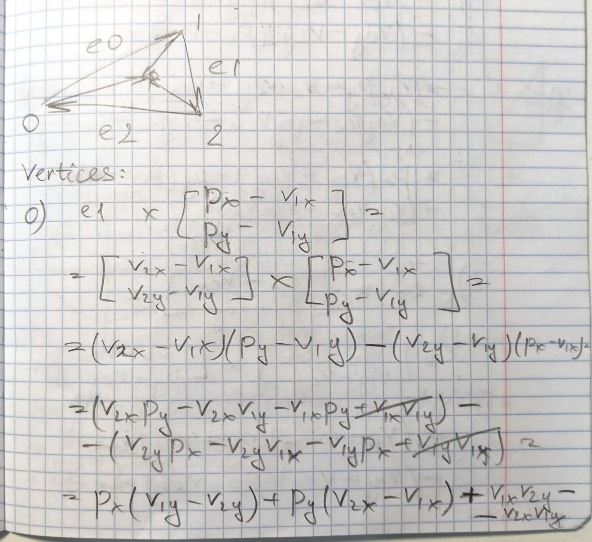
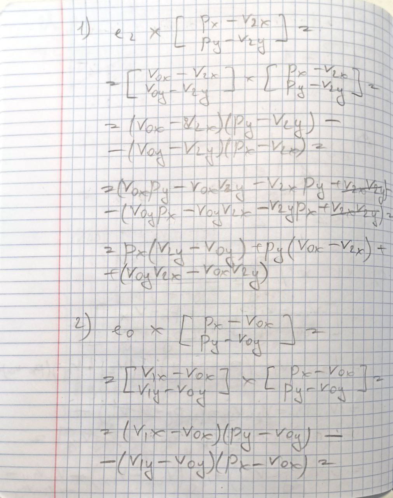
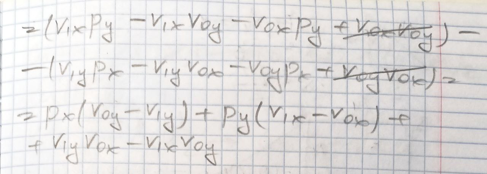

# Triangle

## Incremental computation of [barycentric coordinates](https://en.wikipedia.org/wiki/Barycentric_coordinate_system)

0. When 1 is added to $p_x$, $v_{1y} - v_{2y}$ is added to barycentric coordinates, so let $\delta_{barycentricX0} = v_{1y} - v_{2y}$...
